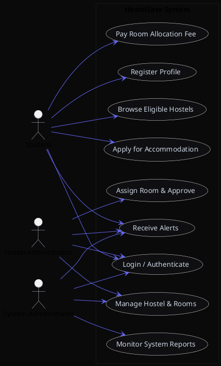
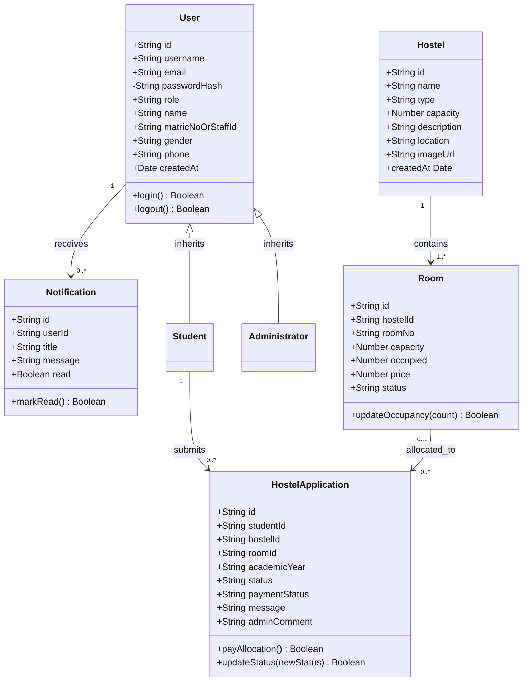
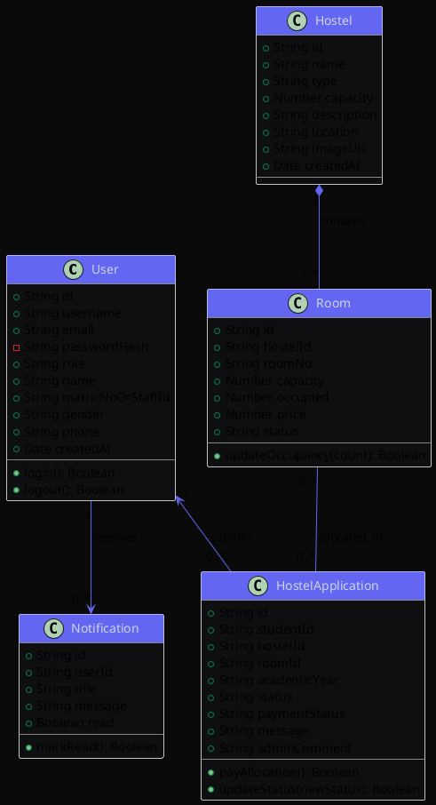
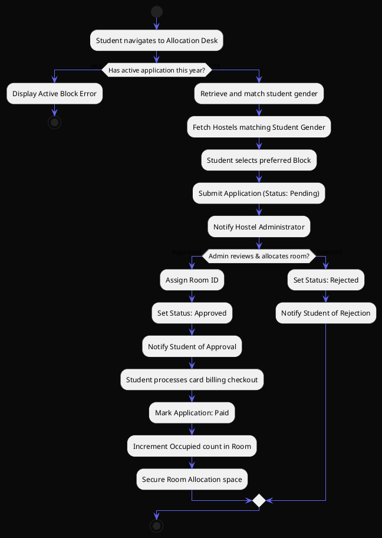
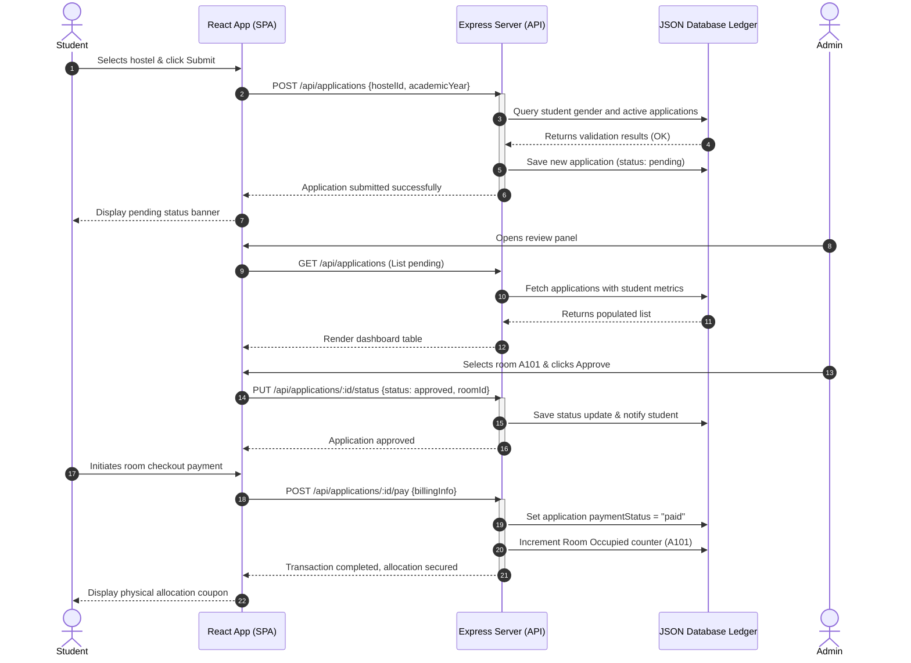
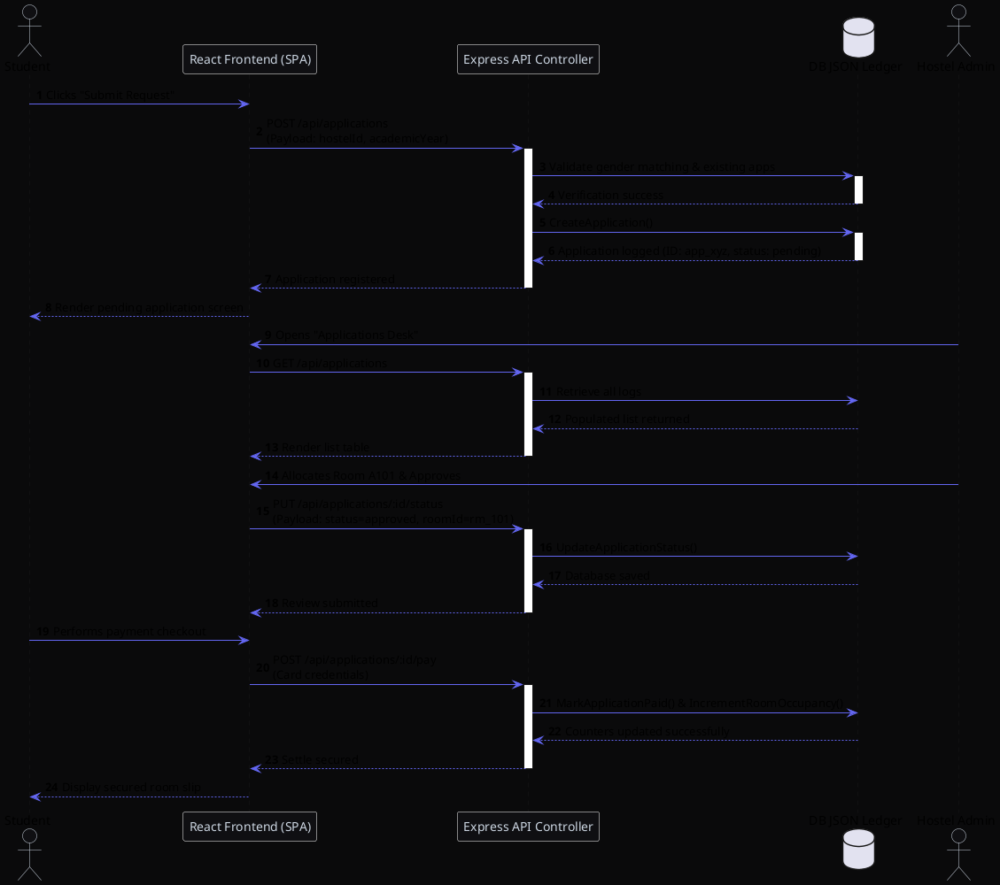
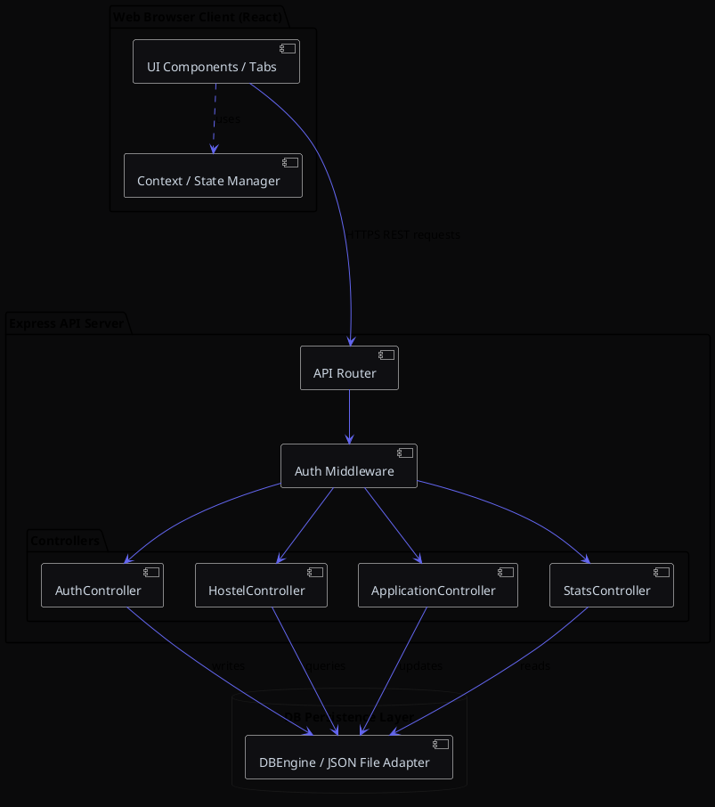
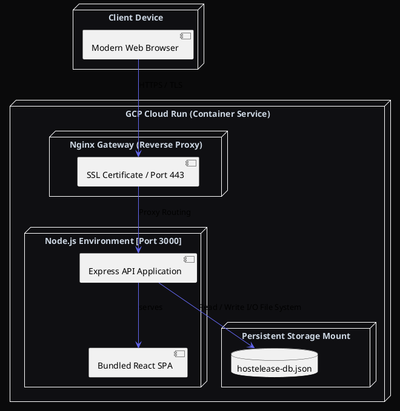

# UML Diagrams Specification
## Project: HostelEase (Online Hostel Allocation System)
### Document Version: 1.0.0
### Standard: Unified Modeling Language (UML 2.5)

This document contains professional UML designs for HostelEase, complete with explanations, Mermaid diagrams, and raw PlantUML code for addition into academic project reports.

---

## 1. Use Case Diagram

### 1.1 Purpose
The Use Case Diagram describes the functional requirements of the system from the perspective of external actors. It depicts the boundaries of the system, the actors interacting with it, and the specific use cases (functions) they execute, indicating the relationship between roles.

### 1.2 UML Component Relationships
*   **Student (Actor):** Can sign up, log in, browse hostels matching gender, submit an application, receive notifications, and make allocation payments.
*   **Hostel Administrator (Actor):** Reviews pending applications, matches rooms, registers hostels and rooms, and updates occupancy.
*   **System Administrator (Actor):** Exercises full administrative authority, supervises all assets, overrides parameters, and monitors financial revenue reports.

### 1.3 Mermaid Diagram
```mermaid
rect bg[#0F0F12]
graph TD
    %% Actors
    S(Student Actor)
    HA(Hostel Admin Actor)
    SA(System Admin Actor)

    %% System Boundary
    subgraph HostelEase Application
        UC1(Register Student Account)
        UC2(Authenticate Session)
        UC3(Browse Matching Hostels)
        UC4(Submit Housing Request)
        UC5(Review & Allocate Room)
        UC6(Settle Allocation Invoice)
        UC7(Manage Hostels & Rooms)
        UC8(Monitor Analytics & Revenue)
        UC9(Receive Notifications)
    end

    %% Student Connections
    S --> UC1
    S --> UC2
    S --> UC3
    S --> UC4
    S --> UC6
    S --> UC9

    %% Hostel Admin Connections
    HA --> UC2
    HA --> UC5
    HA --> UC7
    HA --> UC9

    %% System Admin Connections
    SA --> UC2
    SA --> UC7
    SA --> UC8
    SA --> UC9
```

### 1.4 PlantUML Source Code


---

## 2. Class Diagram

### 2.1 Purpose
The Class Diagram illustrates the static architectural structure of HostelEase. It models the core domain classes, their internal attributes, method operations, visibility modifiers (public `+`, private `-`), and cardinality relationships (multiplicity).

### 2.2 Component Relationships
*   **User (Base)** has a 1-to-many relationship with **Notification** (One user receives many notification alerts).
*   **Student (Inherited from User)** submits 1-to-many **HostelApplication** records.
*   **Hostel** hosts 1-to-many **Room** entities.
*   **Room** is referenced in 0-to-many **HostelApplication** allocations.
*   **HostelApplication** links exactly one **Student**, one **Hostel**, and optionally one allocated **Room**.

### 2.3 Mermaid Diagram


### 2.4 PlantUML Source Code


---

## 3. Activity Diagram

### 3.1 Purpose
The Activity Diagram models the dynamic operational flow of the hostel application and allocation process. It represents the workflow paths, decision points, conditional gates, fork/join operations, and final end states.

### 3.2 Workflow Logic
1.  **Student initiates** a room request.
2.  The system validates whether the student has **already submitted** an application for this session.
3.  If validated, the system filters and displays available hostels **matching the student's gender**.
4.  Student submits the request (state becomes `pending`).
5.  **Hostel Admin reviews** the request.
6.  If **Approved**, the Admin allocates an available room code.
7.  The system alerts the student of the allocation.
8.  The Student **completes card billing** to secure the room slot.
9.  The room's occupancy counter is incremented, and the reservation is locked.

### 3.3 Mermaid Diagram
```mermaid
rect bg[#0F0F12]
stateDiagram-v2
    [*] --> StartApplication
    StartApplication --> CheckExisting : Student opens application tab
    
    state CheckExisting <<choice>>
    CheckExisting --> [*] : Existing application found (Error)
    CheckExisting --> LoadEligibleHostels : No active application exists

    LoadEligibleHostels --> SelectHostel : Filter by gender match
    SelectHostel --> SubmitRequest : Inputs special requests/messages
    SubmitRequest --> PendingReview : Lodged in admin database

    state PendingReview <<state>>
    PendingReview --> AdminDecision : Admin reviews allocation request

    state AdminDecision <<choice>>
    AdminDecision --> RejectedState : Rejected
    AdminDecision --> AllocatedState : Approved (Room Assigned)

    RejectedState --> NotifyStudentReject : Send rejection notification
    NotifyStudentReject --> [*]

    AllocatedState --> PendingPayment : Notify Student of Room Assignment
    PendingPayment --> SubmitCardBilling : Student initiates payment checkout
    SubmitCardBilling --> ConfirmPayment : Bank authorization completes
    ConfirmPayment --> IncrementRoomOccupancy : Secure room slot
    IncrementRoomOccupancy --> FinalAllocationLocked : Mark Paid
    FinalAllocationLocked --> [*]
```

### 3.4 PlantUML Source Code


---

## 4. Sequence Diagram

### 4.1 Purpose
The Sequence Diagram displays the step-by-step runtime interaction and message exchange between system boundaries, controllers, database layers, and external actors over a temporal timeline.

### 4.2 Sequence Scenario: Allocation matching & payment checkout
1.  **Student Actor** initiates a room application.
2.  **HostelEase React SPA** sends a POST payload to `/api/applications`.
3.  **Express Application Controller** validates gender criteria against the **DB Ledger**.
4.  Upon validation, the request is recorded in the **DB Ledger**, and a confirmation is returned.
5.  **Hostel Administrator** fetches applications, assigns a room code, and updates status.
6.  The **SPA UI** notifies the student, who triggers payment.
7.  **Payment Processing Logic** settles the invoice, updates room counts, and locks the bed slot.

### 4.3 Mermaid Diagram


### 4.4 PlantUML Source Code


---

## 5. Component Diagram

### 5.1 Purpose
The Component Diagram details the modular structure of the HostelEase application. It illustrates how the software components (controllers, views, databases) are organized, specifying their interface boundaries and dependencies.

### 5.2 Component Layout and Interactions
*   **Web Browser Client Layer:** Comprises React Views (Dashboard, Forms, Maps, and Invoices) communicating over HTTPS with the backend.
*   **Application Server Component Layer:** Comprises the Router, Middleware validation, and controllers (Auth, Hostels, Rooms, and Applications).
*   **Database Engine Layer:** Handles the storage adapters, transaction logging, schema compliance, and JSON files on disk.

### 5.3 Mermaid Diagram
```mermaid
rect bg[#0F0F12]
graph TD
    subgraph Web Browser Client (Frontend)
        Views[React UI Components / Tabs]
        Context[React Context / Token Manager]
        Views -->|Request Session| Context
    end

    subgraph Express Application Server (Backend)
        Router[Express API Router]
        Middleware[Auth & RBAC Middleware]
        
        subgraph Controllers
            AuthCtrl[Auth Controller]
            HstCtrl[Hostel Controller]
            AppCtrl[Application Controller]
            StatsCtrl[Stats Controller]
        end

        Router --> Middleware
        Middleware --> Controllers
    end

    subgraph Data Layer (Persistence)
        DBEngine[Local Database Engine / File System]
    end

    %% Client to Server connection
    Views -->|HTTPS REST Requests| Router
    
    %% Controller to DB connection
    Controllers -->|CRUD Queries| DBEngine
```

### 5.4 PlantUML Source Code


---

## 6. Deployment Diagram

### 6.1 Purpose
The Deployment Diagram represents the physical deployment topology of the HostelEase software onto hardware nodes. It demonstrates how software modules map to execution environments, container setups, database servers, and reverse proxy architectures.

### 6.2 Deployment Topology and Protocols
*   **User Workstations:** Run standard web browsers accessing the system over HTTPS port 443.
*   **Cloud Run Container (PaaS Server Node):** Encapsulates the Node.js runtime container running the Express.js server, receiving requests on port 3000 behind an nginx reverse proxy.
*   **Virtual Storage Node:** Hosts the secure file-based JSON ledger database.

### 6.3 Mermaid Diagram
```mermaid
rect bg[#0F0F12]
graph TD
    subgraph Client Workstation
        Browser[Modern Web Browser]
    end

    subgraph Cloud Infrastructure (GCP / Cloud Run Container)
        Nginx[Nginx Reverse Proxy / SSL Gateway]
        
        subgraph Node.js Container Workspace [Port 3000]
            Server[Node.js / Express Server]
            StaticFiles[Compiled React Production Assets]
        end

        subgraph Persistent Persistent Volume Mount
            DBFiles[hostelease-db.json Store]
        end

        Nginx -->|Routes Traffic| Server
        Server -->|Launches & Serves| StaticFiles
        Server -->|Saves Records| DBFiles
    end

    Browser -->|HTTPS/TLS Port 443| Nginx
```

### 6.4 PlantUML Source Code

